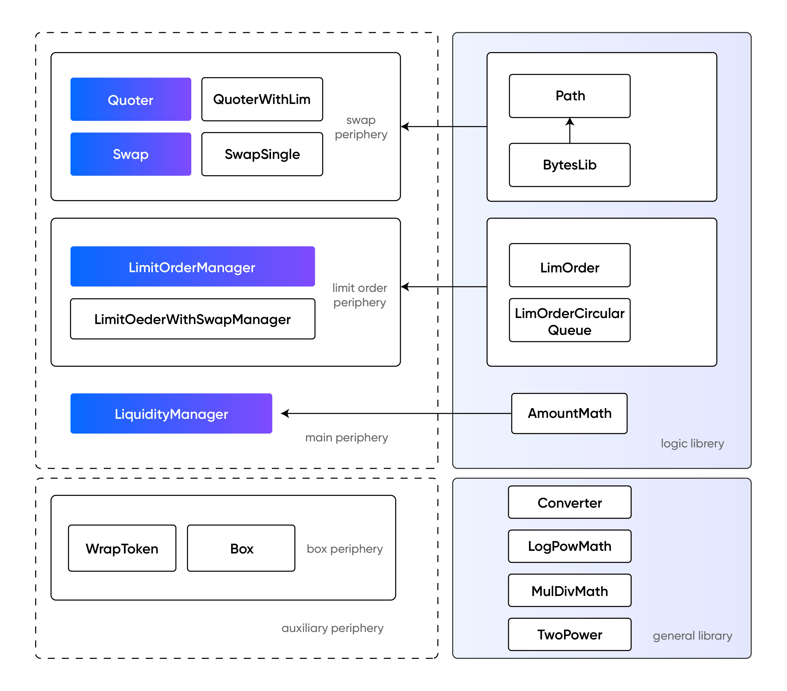

# iZiSwap-periphery

<div align="center">
  <a href="https://izumi.finance"> 
    
  </a>
</div>


Contracts for iZiSwap periphery. Periphery contracts are suggested entrances to interact with 
[iZiSwap Core](https://github.com/izumiFinance/iZiSwap-core) contracts.  

## Overview


<div align="center">
  <a href="https://izumi.finance"> 
    
  </a>
</div>


- Swap Related:
  - **Quoter.sol**: Used for simulating trades without restrictions on identity and assets. Typically called before actual trading to determine how many tokenB can be obtained by exchanging a specified quantity of tokenA.
  - **QuoterWithLim.sol**: similar to Quoter.sol but only search liquidity around the current point to accelerate the search process and void **Out of gas** error.
  - **Swap.sol**: Used to initiates real trades. There are two modes: **amount** mode and **desired** mode. Assuming the exchange is x tokenA -> y tokenB, in amount mode, x is fixed, while in desired mode, y is fixed.

- Limit Order Related:
  - **LimitOrderManager.sol**: Used for managing the logical operations related to limit orders, including placing orders, canceling orders, and claiming the traded tokens. To some extent, this contract is coupled with the core contract and is primarily used to avoid fund temporary storage. Only can place order above the current price for sell or below the current price for buy.
  - **LimitOrderWithSwapManager.sol**: Similar to LimitOrderManger.sol but add an extra mode: swap and place order. In this mode, the price constrains are removed and the portion that should be executed immediately will be traded as a normal swap. Prone to sandwich attacks, careful setting of slippage is required.

- Liquidity Related:
  - **LiquidityManager.sol**: 
  Used for managing the addition, removal, and fee claiming of liquidity. Liquidity is provided in ranges, where each range is determined by a triplet of <min_price, max_price, liquidity>. Each piece of liquidity generates an ERC-721 NFT.

- Auxiliary Contracts:
  - **Box**: Some tokens have additional fees when transferring, which can cause failures in iZiSwap because it uses a callback payment method. In such cases, the original token can be wrapped into a feeless version by using a box to encapsulate it, ensuring a seamless user experience.
    - **WrapToken**: Used to wrap the fee-charging token into a normal one.
    - **Box**: Used to wrap the swap and liquidity management operations. *Do not support limit order*.

## Usage

### Set up Environment

install node.js(at least 14.X) and npm

### Compile from source

##### 1. clone repo from github

```
$ git clone git@github.com:izumiFinance/izumi-swap-periphery.git
```

suppose the root dir of the project is `${IZUMI_SWAP_PERIPHERY}`

##### 2. checkout the branch
cd to the dir `${IZUMI_SWAP_PERIPHERY}` and checkout to the branch you want

##### 3. install denpendencies
install the package listed in the `package.json` via npm

##### 4. compile
compile via following command

```
$ npx hardhat compile
```

##### 5. compiled json file
after compile, the abi and code of the contracts can be found in files `artifacts/*.sol/*.json`

### Run test cases

##### 1. compile izumi-swap-core
before running test case, you should compile [izumi-swap-core](https://github.com/izumiFinance/izumi-swap-core) first.
you can refer to the README.md in the link to compile the core, suppose the project dir of izumi-swap-core 
is `${IZUMI_SWAP_CORE_DIR}`

##### 2. copy compiled json from izumi-swap-core to izmui-swap-periphery
after compile the izumi-swap-core project, copy dirs `${IZUMI_SWAP_CORE_DIR}/artifacts/*.sol` to 
`${IZUMI_SWAP_PERIPHERY}/test/core/`
copy compiled json file of weth9 into `${IZUMI_SWAP_PERIPHERY}/test/core/` and name it as `WETH9.json`
because when we running test cases, we will find abi and code of izumi-swap-core contracts and weth contract under `${IZUMI_SWAP_PERIPHERY}/test/core/`

Your file structure of `${IZUMI_SWAP_PERIPHERY}/test/core/` might be following:
```
/test
    /core
        WETH9.json
        FlashModule.json
        iZiSwapFactory.json
        ...
```

##### 3. run test case
run test cases via following command
```
$ npx hardhat test
```
if you want to only run a single test case, simply run
```
$ npx hardhat test test/${FILE_OF_TEST_CASE}.json
```

### Example of Deploy and interact

##### 1. Example of Deployment
we provide example scripts for deploy contracts.
in the following, we take the example of deploying and interface in izumi-test network, which has been set in `${IZUMI_SWAP_PERIPHERY}/hardhat.config.js`, if you want to deploy and interface in other eth-networks, you could just configure the network in the `hardhat.config.js` and specified it via env var `HARDHAT_NETWORK` when runing coresponding scripts

##### 2. prepare work
establish a file called `.secret.js` under dir `${IZUMI_SWAP_PERIPHERY}`
```
$ cp .secret.js.example .secret.js
```
following 3 field must be filled
change the field of sk to a private key of your sign account of the network you want to deploy

ensure that there exists an deployed `izumi-swap-factory` contract, ofcourse you can deploy it by yourself
 the deployment of IzumiswapFactory can be refered in [izumi-swap-core](https://github.com/izumiFinance/izumi-swap-core) 

you should fill the field `iZiSwapFactory` to corresponding address in the js file `scripts/deployed.js` under the target chain.

##### 3. Deploy "LiquidityManager"

you can refer to the example script `scripts/liquidityManager/deployNFLM.js`.
if you want to deploy it in the bscTest network configered in `hardhat.config.js`, simply run
```
$ HARDHAT_NETWORK='bscTest' node scripts/liquidityManager/deployNFLM.js ${address of WBNB on bscTest}

```
replace `bscTest` and corresponding ${address of WBNB on BSC} if you want to deploy the 2 contracts on other evm-networks

after running, the deployed addresses of `LiquidityManager` can be viewed on the screen.

##### 4. Deploy "LimitOrderManager" contract

if you want to deploy it in the bscTest network configered in `hardhat.config.js`, simply run
```
$ HARDHAT_NETWORK='bscTest' node scripts/limOrderManager/deployLimOrderManager.js ${address of WBNB on bscTest}
```

##### 5. Deploy "LimitOrderWithSwapManager" contract

if you want to deploy it in the bscTest network configered in `hardhat.config.js`, simply run
```
$ HARDHAT_NETWORK='bscTest' node scripts/limOrderWithSwapManager/deployLimOrderWithSwapManager.js ${address of WBNB on bscTest}
```

##### 6. Deploy "Swap" contract.

if you want to deploy it in the bscTest network configered in `hardhat.config.js`, simply run
```
$ HARDHAT_NETWORK='bscTest' node scripts/swap/deploySwap.js ${address of WBNB on bscTest}

```

##### 7. Deploy "Quoter" contract.

if you want to deploy it in the bscTest network configered in `hardhat.config.js`, simply run
```
$ HARDHAT_NETWORK='bscTest' node scripts/quoter/deployQuoter.js ${address of WBNB on bscTest}

```

##### 7. Deploy "Quoter" contract.

if you want to deploy it in the bscTest network configered in `hardhat.config.js`, simply run
```
$ HARDHAT_NETWORK='bscTest' node scripts/quoter/deployQuoter.js ${address of WBNB on bscTest}

```

##### 8. Deploy "Box" contract

Suppose you want to deploy on bscTest network.

Before running box's deploy script, you should fill the field `liquidityManager`, `swap` and `wrapChainToken` to corresponding address in the js file `scripts/deployed.js` under the target chain. Here `wrapChainToken` is address `WBNB` on bscTest network, and if you want to deploy `Box` on other networks, you should replace it to other `wrapped gas token` like `WETH` or `WMATIC` ...

The field `liquidityManager` and `swap` are contracts you just deployed.

After filling those fields, run following command to deploy box.

```
$ HARDHAT_NETWORK='bscTest' node scripts/box/deployBox.js
```

##### 9. Interact with those contracts

You can refer to our iziswap-sdk for interaction.

Check [dev.iZUMi.finance](https://developer.izumi.finance/iZiSwap/SDK/) for in-depth documentation.

Check [Github](https://github.com/izumiFinance/iZiSwap-sdk) for latest sdk code.

### Use source code as npm package

```
$ npm install iziswap_periphery
```

An example to usage interfaces of Swap

```
import '@izumifinance/iziswap_periphery/contracts/interfaces/ISwap.sol';

contract Foo {
  ISwap swapRouter;

  function bar() {
      // swapRouter.swapAmount(...)
      // swapRouter.swapDesire(...)
  }
}
```
